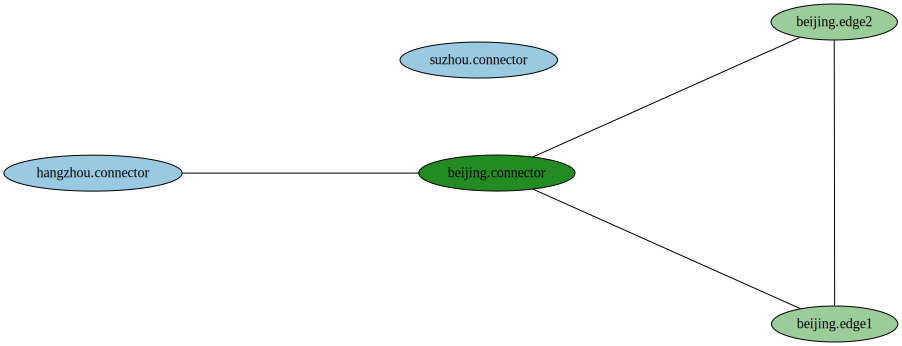

# fabctl
fabctl is a tool to facilitate troubleshooting problems in FabEdge network

## Install

```shell
$ go install github.com/fabedge/fabctl@latest
```

## Usage

### Display Cluster Information

fabctl can collect basic cluster networking information:

```shell
$ fabctl cluster-info

Name:                       beijing
Role:                       host
Region:                     beijing
Zone:                       beijing
CNI Type:                   flannel
EdgePodCIDR:                
Connector Public Addresses: 10.22.46.39
Connector Subnets:          10.233.0.0/18
```

### Display Nodes Information

It can also collect basic networking information from all nodes: 

```shell
$ fabctl nodes
Name:             beijing-master
Public Addresses: 10.22.46.39
Node Subnets:     10.22.46.39
PodCIDRs:         10.233.64.0/24
EdgePodCIDRs:     10.233.64.0/24
Communities:      
Peers:            

Name:             edge1
Public Addresses: 10.22.46.18
Node Subnets:     10.22.46.18
PodCIDRs:         10.233.67.0/24
EdgePodCIDRs:     10.233.67.0/24
Communities:      e2e-all-edges
Peers:            beijing.edge2

Name:             edge2
Public Addresses: 10.22.46.45
Node Subnets:     10.22.46.45
PodCIDRs:         10.233.68.0/24
EdgePodCIDRs:     10.233.68.0/24
Communities:      e2e-all-edges
Peers:            beijing.edge1

```

or display specific node's information:

```shell
$ fabctl nodes edge1

Name:             edge1
Public Addresses: 10.22.46.18
Node Subnets:     10.22.46.18
PodCIDRs:         10.233.67.0/24
EdgePodCIDRs:     10.233.67.0/24
Communities:      e2e-all-edges
Peers:            beijing.edge2
```

or perhaps only edge nodes:

```shell
$ fabctl nodes -e

Name:             edge1
Public Addresses: 10.22.46.18
Node Subnets:     10.22.46.18
PodCIDRs:         10.233.67.0/24
EdgePodCIDRs:     10.233.67.0/24
Communities:      e2e-all-edges
Peers:            beijing.edge2

Name:             edge2
Public Addresses: 10.22.46.45
Node Subnets:     10.22.46.45
PodCIDRs:         10.233.68.0/24
EdgePodCIDRs:     10.233.68.0/24
Communities:      e2e-all-edges
Peers:            beijing.edge1
```

### Generate Topology Picture

fabctl can also generate topology pictures based on communities:

```shell
$ fabctl topology networking.svg
```



### Execute swanctl

Sometimes you may want to checkout strongswan's connections or SAs, fabctl provide swanctl subcommand to save to visit fabedge-agent pod:

#### List Connections

```shell
$ fabctl swanctl list-conns edge1 # edge1 is the name of an edge node

========================== fabedge-agent-844fz =================================
beijing.connector: , no reauthentication, no rekeying
  local:  %any
  remote: 10.22.46.39
  local public key authentication:
    id: C=CN, O=fabedge.io, CN=beijing.edge1
    certs: C=CN, O=fabedge.io, CN=beijing.edge1
  remote public key authentication:
    id: C=CN, O=fabedge.io, CN=beijing.connector
  beijing.connector-p2p: TUNNEL, rekeying every 3600s
    local:  10.233.67.0/24
    remote: 10.233.0.0/18 10.233.64.0/24 10.233.66.0/24
  beijing.connector-n2p: TUNNEL, rekeying every 3600s
    local:  10.22.46.18/32
    remote: 10.233.0.0/18 10.233.64.0/24 10.233.66.0/24
  beijing.connector-p2n: TUNNEL, rekeying every 3600s
    local:  10.233.67.0/24
    remote: 10.22.46.39/32 10.22.46.9/32

```

#### List SAs

```shell
$ fabctl swanctl list-sa edge1

beijing.connector: #236, ESTABLISHED, IKEv2, 355e3f80c2aeded0_i 7eaafa8a10eed99c_r*
  local  'C=CN, O=fabedge.io, CN=beijing.edge1' @ 10.22.46.18[4500]
  remote 'C=CN, O=fabedge.io, CN=beijing.connector' @ 10.22.46.39[4500]
  AES_CBC-128/HMAC_SHA2_256_128/PRF_AES128_XCBC/ECP_256
  established 3808s ago, rekeying in 9420s
  beijing.connector-p2n: #2837, reqid 3, INSTALLED, TUNNEL, ESP:AES_GCM_16-128
    installed 2014s ago, rekeying in 1257s, expires in 1946s
    in  cab16114,      0 bytes,     0 packets
    out c1ef7ca7,      0 bytes,     0 packets
    local  10.233.67.0/24
    remote 10.22.46.9/32 10.22.46.39/32
  beijing.connector-n2p: #2839, reqid 1, INSTALLED, TUNNEL, ESP:AES_GCM_16-128
    installed 1070s ago, rekeying in 2287s, expires in 2890s
    in  c6206487,      0 bytes,     0 packets
    out cb272bc0,      0 bytes,     0 packets
    local  10.22.46.18/32
    remote 10.233.0.0/18 10.233.64.0/24 10.233.66.0/24
  beijing.connector-p2p: #2842, reqid 2, INSTALLED, TUNNEL, ESP:AES_GCM_16-128
    installed 618s ago, rekeying in 2650s, expires in 3342s
    in  caa3aa87,      0 bytes,     0 packets
    out cc862ebf,      0 bytes,     0 packets
    local  10.233.67.0/24
    remote 10.233.0.0/18 10.233.64.0/24 10.233.66.0/24
```

#### Initiate IKE

You can initiate an IKE or child SA on specific edge node:

```shell
$ fabctl swanctl initiate edge1 --ike beijing.connector
$ fabctl swanctl initiate edge1 --child beijing.connector-p2p
```

#### Terminate IKE

You can also terminate an IKE or child SA on specific edge node:

```shell
$ fabctl swanctl terminate edge1 --ike beijing.connector
$ fabctl swanctl terminate edge1 --child beijing.connector-p2p
```

#### More swanctl commands

You can execute other swanctl commands in this way:

```shell
$ fabctl swanctl edge1 -- --stats	
$ fabctl swanctl edge1 -- --list-conns
$ fabctl swanctl edge1 -- --list-sa
```

### Ping

You can ping between two nodes to check if they can communicate:

```shell
$ fabctl ping edge1 edge2

Ping from net-tool-edge1(10.233.67.56) -> net-tool-edge2(10.233.68.60) 

PING 10.233.68.60 (10.233.68.60) 56(84) bytes of data.
64 bytes from 10.233.68.60: icmp_seq=1 ttl=62 time=0.812 ms
64 bytes from 10.233.68.60: icmp_seq=2 ttl=62 time=0.527 ms
64 bytes from 10.233.68.60: icmp_seq=3 ttl=62 time=0.477 ms
64 bytes from 10.233.68.60: icmp_seq=4 ttl=62 time=0.641 ms
64 bytes from 10.233.68.60: icmp_seq=5 ttl=62 time=0.506 ms

--- 10.233.68.60 ping statistics ---
5 packets transmitted, 5 received, 0% packet loss, time 4000ms
rtt min/avg/max/mdev = 0.477/0.592/0.812/0.123 ms
Ping from net-tool-edge2(10.233.68.60) -> net-tool-edge1(10.233.67.56) 

PING 10.233.67.56 (10.233.67.56) 56(84) bytes of data.
64 bytes from 10.233.67.56: icmp_seq=1 ttl=62 time=0.553 ms
64 bytes from 10.233.67.56: icmp_seq=2 ttl=62 time=0.571 ms
64 bytes from 10.233.67.56: icmp_seq=3 ttl=62 time=0.404 ms
64 bytes from 10.233.67.56: icmp_seq=4 ttl=62 time=0.479 ms
64 bytes from 10.233.67.56: icmp_seq=5 ttl=62 time=0.497 ms

--- 10.233.67.56 ping statistics ---
5 packets transmitted, 5 received, 0% packet loss, time 4001ms
rtt min/avg/max/mdev = 0.404/0.500/0.571/0.059 ms
```

###  Create net-tool Pod

Maybe you need an net tool pod on specific to diagnose networking problems, try this:

```shell
$ fabctl net-tool edge1 # create an net-tool pod which use cluster network
```

or

```shell
$ fabctl net-tool --host edge1 # create an net-tool pod which use host network
```

### Verify Certificate 

FabEdge create certificates for each edge node, all those certificates are save in secret, fabctl provide an subcommand to verify and display the content of an certificate secret:

```shell
$ fabctl cert verify fabedge-agent-tls-edge1
fabedge-agent-tls-edge1 is valid
$ fabctl cert view fabedge-agent-tls-edge1
Version: 3
Subject: CN=beijing.edge1,O=fabedge.io,C=CN
Issuer: CN=Fabedge CA,O=fabedge.io,C=CN
IsCA: false
Signature Algorithm: SHA384-RSA
Publickey Algorithm: RSA
Validity: 
      Not Before: 2022-09-28 02:19:27 +0000 UTC
      Not After: 2032-09-25 02:19:27 +0000 UTC
Key length: 2048
Key Usage: DigitalSignature KeyEncipherment
Ext Key Usage: ServerAuth ClientAuth
DNS Names: 
IP Addresses: 
Email Addresses: 
URIs: 

```

